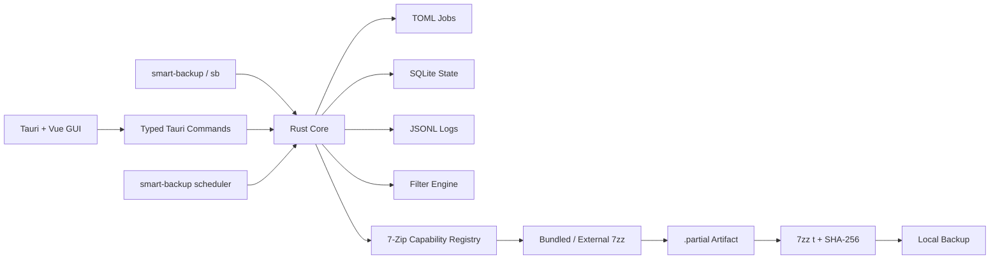
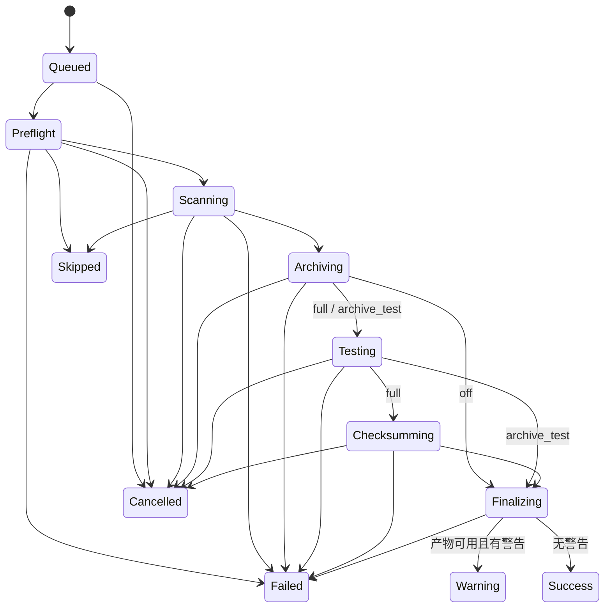
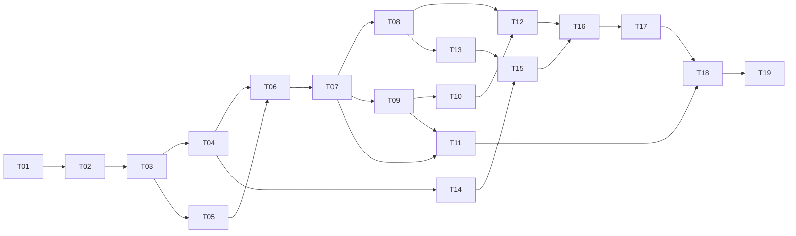

# SmartBackup 技术规格与实施任务书

> 状态：正式版需求基线；已实现 CLI alpha 原型，实际能力与未完成项见 [docs/MVP.md](docs/MVP.md)  
> 工作名称：SmartBackup\
> CLI：`smart-backup`，简写 `sb`  
> 文档日期：2026-09-08  
> 版本规范：[Semantic Versioning 2.0.0](https://semver.org/lang/zh-CN/)

## 1. 文档目的

本文档是 SmartBackup 的需求与技术基线，汇总产品定位、最终决策、数据边界、安全约束、跨平台行为和验收标准。交接者不需要回看需求讨论即可据此拆解和实施。

历史 BAT 原型已退役并从工作目录移除。新项目按本规格实现，不继承同名归档滚动更新行为。

## 2. 产品定位

SmartBackup 是面向个人用户和开发者的跨平台桌面文件备份工具。用户可以把一个或多个普通文件或目录备份为标准压缩包，并在不依赖 SmartBackup 的情况下用兼容解压工具恢复。

### 2.1 目标用户

- 备份文档、照片、项目目录和游戏存档等普通文件的个人用户；
- 希望通过 GUI 配置、通过 CLI 自动化的开发者；
- 需要 Windows、macOS 和 Linux 一致体验的用户。

### 2.2 核心价值

- 产物是普通、开放、可独立解压的压缩包，而不是私有备份仓库；
- GUI、CLI 和调度器共享同一个 Rust Core；
- 保留 7-Zip 原生能力，同时增加安全的任务模型、校验、历史和恢复流程；
- 默认行为可解释，过滤、风险参数和降级行为全部对用户可见。

### 2.3 非目标

首版不承诺：

- 企业集中管理、多租户、RBAC 或审计平台；
- 整机镜像、裸机恢复和操作系统灾难恢复；
- 数据库、虚拟机磁盘等活动数据的一致性热备；
- 完整还原 ACL、所有权、扩展属性、NTFS ADS、macOS resource fork 或硬链接关系；
- 无人登录时以系统服务或 root/管理员身份运行；
- 私有去重仓库或依赖增量链的恢复模型。

## 3. 术语

| 中文 | 英文 | 定义 |
| --- | --- | --- |
| 备份计划 | Job | 长期存在、可重复或定时执行的 TOML 配置 |
| 备份执行 | Run | 某一次计划运行，具有开始、结束和状态 |
| 备份产物 | Artifact | 一次成功执行生成的一个压缩包或一组分卷及校验清单 |
| 本地备份 | Local backup | 将产物写入任务配置的唯一主输出目录 |
| 规则集 | Rule set | 决定哪些来源内容进入归档的过滤规则 |

成功交付后，Artifact 的生命周期归用户管理。应用不持续索引、监控或追踪它。

## 4. 核心产品原则

1. **不可变快照**：每次有效执行生成一个新的、可独立恢复的压缩包。
2. **来源只读**：受管理任务永远不删除、移动或修改来源。
3. **按策略验证后提交**：默认 `full`；`archive_test` 通过归档结构测试后也可记为 `verified`，`off` 必须记为 `unverified` 且不得触发保留清理。
4. **不伪造成功**：缺源、读失败、目标掉线或引擎异常必须产生准确状态。
5. **不静默降级**：加密、过滤、权限、平台能力不可用时明确失败或告警。
6. **最小权限**：不自动提权，Vue 前端不能直接访问任意文件或进程。
7. **普通格式优先**：脱离本软件仍能用标准工具恢复。
8. **安全删除边界**：删除计划不删除压缩包；首版 GUI 不提供手动删除压缩包。

## 5. 技术选型

### 5.1 确认选型

| 层 | 技术 |
| --- | --- |
| 备份核心 | Rust |
| CLI | Rust 独立可执行程序 |
| GUI | Tauri 2 + Vue 3 + TypeScript |
| 状态与历史 | SQLite |
| 人类可编辑配置 | TOML |
| 详细事件日志 | JSONL |
| 压缩引擎 | 随包内置、锁定版本并校验的官方 `7zz` sidecar |
| 密钥存储 | Windows Credential Manager / macOS Keychain / Linux Secret Service |

Tauri 优先于 Slint，原因是复杂表单、图表、动画、主题、辅助功能和自动化测试的 Web 生态更成熟。Rust Core 必须与 GUI 解耦，未来替换界面不重写备份逻辑。

### 5.2 进程结构



GUI 与 CLI 分离交付；`scheduler` 是 CLI 子命令。GUI 和 scheduler 各自单实例，多个 CLI 可以并发启动，但写操作必须进入统一协调队列。

## 6. 数据与配置模型

### 6.1 文件职责

```text
app-data/
├── config.toml                 # 全局设置
├── config.toml.bak             # 最近一次普通编辑前版本
├── jobs/
│   ├── <job-id>.toml           # 每个计划独立定义
│   └── <job-id>.toml.bak       # 最近一次普通编辑前版本
├── state.db                    # 动态状态、摘要历史和扫描缓存
├── logs/
│   └── <run-id>.jsonl          # 单次执行详细日志
└── migration-backups/          # 配置结构升级前的整套快照
```

- TOML 只保存声明式配置，不保存频繁变化的运行状态；
- SQLite 不作为计划定义的唯一来源；
- JSONL 保存进度事件、原始引擎输出、警告和错误；
- 全局配置和每个 Job 都同时提供 GUI 可视化编辑与高级 TOML 源码编辑；
- 解析/保存采用保留格式的 TOML 文档模型，往返编辑必须保留注释、字段顺序和当前版本未知字段；
- 密码不得进入任何上述文件；
- 安装模式下应用数据目录仅允许当前用户访问；
- FAT/exFAT 等不支持细粒度权限时必须提示；
- `--portable` 或便携标记启用便携模式，配置、数据库和日志存放在程序旁；钥匙串凭据不可便携。

### 6.2 全局配置要求

以下为规范性结构示例，实施时可增加字段，但不得改变已确认语义：

```toml
schema_version = 1
max_parallel_runs = 1

[logs.retention]
max_age = "7d"
max_size = "1g"

[config_migration]
keep_backups = 1

[updates]
enabled = true
check_on_start = true
interval = "1d"
source = "github-releases"

[new_job_defaults.filters]
use_builtin_common_gitignore = true
follow_source_gitignore = false
```

约定：

- 时间单位支持 `m`、`h`、`d`；
- 空间单位支持 `k`、`m`、`g`、`t`；
- `1g` 等于 1024³ bytes；
- 省略限制字段表示不限制该项；
- 日志超过任一上限时按最旧优先清理已结束执行的详细日志；
- 不清理 SQLite 摘要、压缩包或 SHA-256 文件；
- 日志清理行为写入审计摘要。

### 6.3 计划配置要求

每个 Job：

- 创建时生成永久不变的 UUID；
- 名称可修改，但在当前配置中按 Unicode `NFKC_Casefold` 比较键判断唯一，原始显示字符串原样保留；
- 改名不改变 UUID、历史、调度器关联或旧归档记录；
- 支持中文和 Unicode 名称；
- 配置文件包含 `schema_version`；
- GUI 和高级 TOML 编辑器均可编辑；
- 保存前做格式、路径、参数组合和名称校验；
- 采用“写临时文件 → 解析校验 → 原子替换”；
- 普通编辑仅保留最近一份 `.bak`；
- 发现外部修改时拒绝静默覆盖，并显示差异。

任务配置至少覆盖：

- 启用状态、名称、说明；
- 一个或多个来源及归档别名；
- 每个来源是否必需、是否跟随符号链接、是否跨文件系统；
- 唯一输出目录及卷/挂载身份；
- 格式、算法、压缩级别、字典、固实块、线程和分卷；
- 加密和文件名加密；
- 过滤规则及规则来源；
- 变化检测策略；
- 校验、命名和保留策略；
- 调度、错过任务和电源策略；
- 通知、进程优先级和日志偏好；
- 受约束的 7-Zip 附加参数数组。

### 6.4 配置迁移

- `0.y.z` 阶段也必须显式迁移 schema；
- 升级前备份 `config.toml` 和全部 Job TOML，形成一个完整迁移快照；
- 默认只保留上一套，数量由 `config_migration.keep_backups` 配置；
- `0` 允许不保留，但 GUI 显示风险；
- 迁移失败时不得删除刚创建的恢复快照；
- 迁移失败保持原配置不变并进入只读修复状态；
- 单个 Job 配置损坏只隔离该 Job，其他任务继续；
- 全局配置损坏时停止新的定时执行，直到修复或恢复。

### 6.5 导入与导出

首版支持导出、导入单个 Job TOML：

- 导出不包含密码、钥匙串引用、来源/输出绝对路径、磁盘身份或运行状态；
- 导入后生成新 UUID；
- 导入计划默认禁用；
- 用户重新绑定来源、输出和密码后才能启用；
- 保留名称、说明、别名、格式、参数、过滤规则和命名模板。

### 6.6 SQLite 损坏

- Job TOML 必须仍可读取和编辑；
- 将损坏数据库保留为诊断副本，不自动上传；
- 创建新的空数据库；
- 下一次执行按首次扫描处理；
- 因没有可信候选历史，不自动清理旧备份；
- 不扫描输出目录重建“备份库”。

## 7. 来源模型

### 7.1 多来源与别名

- 一个 Job 可包含任意数量的文件和目录；
- 来源可位于不同磁盘或挂载点；
- 每个来源必须有唯一的归档顶层别名；
- 归档不得记录本机绝对来源路径；
- 允许重复来源或父子嵌套来源；
- GUI 对重叠关系做非阻塞提示；
- 不做隐式去重，归档结构严格遵循别名配置。

示例：

```text
backup.7z
├── Documents/
├── Project-A/
└── Game-Saves/
```

### 7.2 必需与可选来源

- 来源默认必需；
- 必需来源缺失：`failed`；
- 可选来源缺失：继续处理其他来源并明确记录；
- 全部来源都可选且均不可用：`skipped/no_available_sources`，不生成空包；通知遵循 Job 的最终状态通知设置，默认不通知 `skipped`；
- 必需来源存在但为空目录：可以生成包含空目录结构和 manifest 的备份；
- 来源存在但过滤后为空：首次可生成结构性空备份，后续无变化则 `skipped/no_changes`。

### 7.3 路径和卷身份

- 来源和输出都记录路径与创建任务时的卷/挂载身份；
- 当前路径存在但身份不匹配时不得继续；
- 外接盘、网络挂载缺失时不得创建一个同名普通目录冒充挂载点；
- 更换、格式化或重新绑定设备必须由用户在 GUI 中确认。

持久化身份采用带类型的结构 `{binding_version, kind, primary_id, corroborating_ids, fs_type}`；`corroborating_ids` 是可选的 typed map。显示名称、卷标和当前设备节点只用于提示，不参与唯一判断：

| 平台/类型 | `primary_id` 来源 | `corroborating_ids` 来源与说明 |
| --- | --- | --- |
| Windows 本地卷 | Volume GUID | volume serial；盘符仅作显示，不作为 ID |
| macOS 本地卷 | Disk Arbitration 提供的 Volume UUID | 平台可得的 media/device UUID；挂载路径仅作显示 |
| Linux 本地卷 | 文件系统 UUID | 可得的稳定 partition/device-mapper UUID；动态设备节点、mount source 和 `major:minor` 只作当次诊断 |
| 网络挂载 | 规范化协议、服务端和 share/export 标识 | 协议提供的稳定 volume ID；凭据不得进入任何 ID |
| FAT/exFAT 等 | 平台可获得的卷 GUID/serial/UUID | 可得的第二稳定标识；能力有限时允许为空，同时提示权限限制 |

绑定时拿不到稳定 `primary_id` 的路径在首版不能启用为受管理 Job 来源或输出，界面显示 `unsupported_volume_identity`，不得偷偷退化为纯路径比较。运行时比较真值表：

| 运行时证据 | 结果 |
| --- | --- |
| `kind`、`fs_type`、`primary_id` 相同，所有双方可见的辅助 ID 相同 | `match` |
| `primary_id` 相同，但某个已绑定辅助 ID 暂时不可读取 | `match`，记录非终态提示 `identity_evidence_reduced` |
| `primary_id` 相同，但任一双方都可见的同类型辅助 ID 值不同 | `failed/volume_identity_mismatch` |
| `primary_id` 不同，或 `kind`/`fs_type` 不同 | `failed/volume_identity_mismatch` |
| 运行时拿不到 `primary_id` | `failed/volume_identity_unavailable` |

运行时新出现的辅助 ID 只作诊断，不自动改写绑定；用户显式重新绑定后才持久化。重新格式化后即使卷名相同也视为新身份；重新绑定必须展示旧/新身份并由用户确认。上述真值表对来源和输出分别执行，并纳入 T03 跨平台契约测试。

### 7.4 递归与文件系统边界

- 输出目录位于任一来源内部时，任务配置无效；
- 不提供绕过开关，防止产物被下一次备份递归打包；
- 来源重叠不属于递归错误；
- 默认不跨入来源内部的其他文件系统或网络挂载；
- 每个来源可显式允许跨文件系统；
- 预览列出被跳过的挂载点。

### 7.5 符号链接和活动文件

- 默认保存符号链接本身，不跟随目标；
- 可按来源开启跟随；
- 跟随时检测循环，并警告可能越出来源范围；
- 默认不强行备份无法稳定读取的活动文件；
- 7-Zip 报告占用、读失败或读取期间变化时，结果为 `warning`；
- 高级选项可启用“尝试读取活动文件”，映射 `-ssw` 等能力；
- GUI 明确说明活动数据可能不一致；
- VSS、APFS、LVM/Btrfs 等一致性快照列入后续路线。

### 7.6 元数据承诺

首版保证：

- 普通文件内容；
- 目录结构；
- 文件名；
- 修改时间；
- 按既定策略处理的符号链接。

Unix 权限、Windows 属性等在格式与平台支持时尽力保留。首版不保证 ACL、所有权、扩展属性、NTFS ADS、resource fork 和硬链接关系。

## 8. 归档与 7-Zip 能力

### 8.1 正式创建格式

首版 GUI 正式支持并测试：

- `.7z`；
- `.zip`；
- `.tar`；
- `.tar.gz`；
- `.tar.xz`；
- `.tar.bz2`。

`tar.gz`、`tar.xz` 和 `tar.bz2` 是两阶段组合格式，必须由应用正确编排，不得假装所有格式都能直接压缩目录。

WIM 等平台偏置格式不进入首版 GUI。CLI 原生代理可以使用当前 `7zz` 的其他能力。

### 8.2 能力注册表

应用启动或引擎切换时执行能力探测，不硬编码所有组合。Rust 的 7-Zip Capability Registry 是以下功能的唯一说明来源：

- GUI 格式、算法和参数选项；
- 参数旁的 `?` 帮助提示；
- CLI `--help`；
- TOML 字段说明；
- 格式、平台和版本适用范围；
- 参数组合校验；
- 风险级别和推荐值；
- 最终参数预览。

每个 7-Zip 选项的提示至少包含：作用、对应原生参数、风险和适用范围。提示必须支持鼠标悬浮、点击和键盘聚焦。

### 8.3 参数与 CLI 代理

受管理任务使用结构化字段和参数数组，禁止拼接 shell 字符串。

普通附加参数不能覆盖：

- 来源；
- 输出路径；
- 密码；
- 工作目录；
- 临时目录；
- 进度和日志通道；
- 其他由 Core 保证安全性的关键参数。

冲突在保存配置时即报错。

完全原生代理：

```text
smart-backup 7z -- a -t7z -mx=9 archive.7z ./source
sb 7z -- a -t7z -mx=9 archive.7z ./source
```

`--` 后的 argv 原样交给 `7zz`，但仍不经过 shell。该模式不承诺 Job 历史、智能变化检测、恢复映射或 GUI 预估。
它可以执行 `u` 等原生更新/覆盖语义，但这些行为始终位于受管理 Job 之外，不改变“受管理备份只生成不可变快照”的原则。

### 8.4 压缩预设

GUI 提供：

| 预设 | 典型映射 | 说明 |
| --- | --- | --- |
| 快速 | `-mx=3` | 更低资源占用 |
| 均衡（默认） | `-mx=5` | 日常备份推荐 |
| 极限 | `-mx=9` | 更慢、更高内存 |
| 自定义 | 能力驱动 | 算法、字典、固实块、线程等 |

具体映射由格式和探测能力决定。GUI 显示预计内存与性能影响。

运行优先级手动和定时均默认为“正常”，可选“低”；线程数默认为 `7zz` 自动决定，也可指定。复杂动态 CPU、内存和磁盘限速列入后续路线。

### 8.5 分卷

- 首版支持可选分卷；
- 支持常用预设和自定义大小；
- 全部分卷构成一个 Artifact；
- 缺少任一分卷即不是完整产物；
- 恢复通常从 `.001` 开始；
- 保留策略必须整组处理；
- 格式是否支持分卷由能力探测决定。

### 8.6 内置与外部引擎

- 正式包默认内置锁定版本的官方 `7zz`；
- 随包提供版本、SHA-256 和第三方许可证清单；
- 调用前校验完整性；
- 校验失败时拒绝所有受管理的备份、测试和恢复；
- 不从网络静默下载替换引擎；
- 高级设置允许用户选择外部 `7zz/7z`；
- 外部引擎明确标记为“用户提供”，重新探测能力，不宣称通过内置校验。

## 9. 过滤系统

### 9.1 责任边界

`7zz` 提供 `-x`、`-xr` 和列表文件等底层排除能力，但 SmartBackup 仍需独立 Filter Engine，以保证：

- 变化检测；
- 模拟预览；
- 预计大小；
- 最终传给 `7zz` 的文件集合；
- GUI 规则解释

尽可能一致。

受管理 Job 的高级过滤语法采用 gitignore 语义。原生 7-Zip 过滤只通过完全原生代理使用，避免两套语义在受管理任务中冲突。

### 9.2 规则来源与优先级

从低到高：

1. 内置常用 `.gitignore` 排除规则；
2. 来源树中动态读取的 `.gitignore`；
3. Job 引用的本地规则文件；
4. Job 内联自定义规则。

后出现的规则覆盖前面的匹配结果，支持 `!` 重新包含。禁止输出目录递归的系统规则优先级最高，任何用户规则都不能覆盖。

### 9.3 默认行为

全新安装的新 Job 默认：

```text
[✓] 使用内置常用 .gitignore 排除规则
[ ] 遵循来源目录中的 .gitignore
```

全局设置只作为未来新 Job 的初始模板；修改后不影响已有 Job。

### 9.4 内置规则边界

工厂默认开启的内置规则只排除跨项目普遍无价值、可安全重建的系统杂项：

- `desktop.ini`；
- `Thumbs.db`；
- `.DS_Store`；
- `CACHEDIR.TAG` 及其标记语义覆盖的缓存目录。

以下内容不得在默认规则中排除：

- `.git`、`.env` 和锁文件；
- `node_modules`、`target`、`.venv`；
- `build`、`dist` 或任何看似可重建但可能含用户产物的目录。

可以提供显式选择的开发场景模板，但必须由用户主动启用。若模板内容参考 CC0-1.0 的 GitHub `gitignore`，只采用已固定版本的规则，并在第三方清单中标注来源。

### 9.5 动态规则与故障行为

- 启用“遵循来源 `.gitignore`”后，每次 Run 都重新读取来源树中的规则；
- Job 引用的本地规则文件也在每次 Run 时读取，而不是复制进 Job；
- 本地规则文件缺失或不可读时，本次执行继续，但状态至少为 `warning`，并明确说明相应规则没有应用；
- 首版不在线同步过滤规则；
- 预览必须能解释某路径由哪条规则排除或重新包含；
- 规则解析、变化检测和归档输入必须共享同一规范化结果，不能各自实现近似语义。

## 10. 变化检测与模拟预览

### 10.1 变化检测策略

每个 Job 可选：

| 策略 | 默认 | 行为 |
| --- | --- | --- |
| `metadata` | 是 | 比较路径、类型、大小、修改时间等元数据 |
| `hash` | 否 | 对候选文件计算内容哈希，成本更高 |
| `always` | 否 | 每次触发都创建新快照 |

- 没有变化时返回 `skipped/no_changes`，不创建产物，也不执行保留清理；
- 用户可手动“强制备份”，跳过无变化判定；
- 首次运行、扫描缓存缺失或数据库重建后按完整扫描处理；
- 变化检测使用过滤后的逻辑输入集；
- 检测与实际读取之间发生变化时按活动文件策略报告，不把预扫描结果当作一致性快照。

### 10.2 预览与 Dry Run

首版 GUI 和 CLI 都提供不产生备份副作用的预览，至少显示：

- 可用、缺失及身份不匹配的来源；
- 将包含和排除的文件数与预计字节数；
- 过滤原因、跨挂载点和符号链接警告；
- 预计产物名、格式、分卷和目标路径；
- 预计临时空间与目标可用空间；
- 将采用的变化检测、校验、保留和通知策略；
- 已脱敏的最终 `7zz` argv 预览。

Dry Run 不创建归档、不写正式 Run 历史、不修改配置、不执行保留清理，也不改变变化检测基线；可以写入带 `dry_run = true` 标记的本地诊断日志，但必须与真实 Run 明确区分。

## 11. Run 生命周期与状态机

### 11.1 标准阶段



稳定的最终状态只有：

| 状态 | 含义 | 是否交付产物 | 是否触发保留 |
| --- | --- | --- | --- |
| `success` | 完整完成并满足用户所选验证策略 | 是 | 仅 `verification_state = verified` 时 |
| `warning` | 产物可用但存在跳过、读失败或运行期变化 | 是 | 否 |
| `failed` | 无可信可交付产物 | 否 | 否 |
| `cancelled` | 用户或系统明确取消 | 否 | 否 |
| `skipped` | 按策略无需或不能开始 | 否 | 否 |
| `interrupted` | 进程崩溃、掉电或异常终止留下的未完成执行 | 否 | 否 |

`skipped` 和其他状态同时带稳定原因码，例如 `no_changes`、`no_available_sources`、`ac_required`。CLI JSON、数据库和 GUI 使用相同枚举。

### 11.2 预检与空间策略

预检至少检查：

- Job 与全局配置有效；
- 来源路径和卷身份；
- 输出不在来源内部，且输出卷身份匹配；
- 引擎存在、版本可读且内置引擎校验通过；
- 格式、加密、分卷和附加参数组合受支持；
- 密钥可用；
- 预计来源大小、临时空间和目标空间；
- 同 Job 未运行且队列中没有重复项。

定时 Run 预计空间不足时保守失败。手动 Run 可在清楚展示风险后明确选择继续尝试。真实写满时只清理本次拥有的临时产物，既有备份不受影响，也不为腾空间提前执行保留策略。

### 11.3 临时产物与安全交付

- 小型扫描清单、manifest 草稿或归档 partial 可以使用系统临时目录，但待交付的最终字节必须先复制到输出卷 staging，随后重新执行所选测试/哈希；只有输出卷 staging 参与提交；
- 大型归档、两阶段 TAR 中间物和分卷必须优先放在输出文件系统的私有临时目录，避免跨卷复制和双倍空间峰值；
- 临时名称包含不可猜测的 Run ID，并存放在输出卷的私有 `.smart-backup-staging/<run-id>/` 或等价目录；
- 只在按所选策略完成验证，或对 `off` 明确记录 `unverified` 后执行最终提交；
- 只有一个待交付文件的 Artifact 在同一文件系统内使用原子 rename；凡包含 `.sha256` 或分卷的多文件 Artifact 都采用有持久化 journal 的可恢复、幂等事务式提交，绝不能先覆盖既有产物；
- 正式名称冲突时追加确定性的序号，不更新或覆盖旧归档。

多文件 Artifact 提交协议固定为：

1. 在 staging 目录生成单个归档或全部分卷，以及验证策略要求的 `.sha256`；完成验证后写入包含源/目标名、大小、哈希和 `run_id` 的 commit journal 并 `fsync`；
2. 为整组基名建立原子 exclusive reservation；将归档文件或数据分卷逐个以 no-replace 语义落到最终名称，若有 `.sha256` 则最后落位它；
3. 全部目标再次核对后，在 SQLite 事务中把 Artifact 标为已交付，再移除 journal 和空 staging 目录；
4. 启动恢复发现 journal 时：若所有目标齐全且哈希吻合则幂等补记交付；否则只回滚能由 journal、manifest 和哈希共同证明属于该 Run 的目标，未知或被外部改动的文件保留并告警。

“正式产物列表”和保留候选只读取 SQLite 中已交付的 Artifact；提交中途出现的最终名文件不得被当作成功产物。

no-replace 必须使用平台原语：Windows move 不带 replace、macOS `renameatx_np(RENAME_EXCL)`、Linux `renameat2(RENAME_NOREPLACE)`。文件系统不支持时，可退化为 exclusive-create → copy → `fsync` → 哈希核对 → 删除 staging 源的协议，但绝不能调用会覆盖目标的普通 rename。若检查后有外部进程抢占任一目标名，记录 `artifact_name_race`，通过 journal 回收仍可证明归属的已落位文件，为整组选择下一个序号后有限次重试；未知文件不覆盖也不删除。

### 11.4 取消、崩溃与关机

- 取消先向 `7zz` 发出优雅终止信号，超时后再强制结束；
- `checksumming` 结束前接受取消并清理本次 partial；进入 `finalizing` 提交事务后不再中断，取消请求显示为“正在完成安全提交”，提交结果决定最终状态；
- 默认删除本次已确认归属的 partial；可选“保留用于诊断”，但它不得出现在正常产物列表或保留候选中；
- 启动时把失去宿主进程的未完成 Run 标为 `interrupted`；
- 只有在 Run 所有权可验证且相关进程已不存在时，才自动删除遗留 partial；归属未知时保留并提示；
- 首版不续传、不恢复中断压缩；
- 应用退出或系统关机请求到来时，短暂尝试优雅停止；下次启动按中断恢复规则收尾；
- 禁用 Job 不取消正在执行的 Run，但移除该 Job 尚未开始的排队项。

### 11.5 并发、电源和睡眠

- 默认全局串行执行，`max_parallel_runs = 1`；
- 可提高全局并发，但同一个 Job 永不重叠；
- 同一 Job 已运行或已排队时不重复入队；
- GUI、scheduler 和独立 CLI 进程通过统一锁与 SQLite 协调队列；
- 手动和定时 Run 默认都使用正常进程优先级，可配置为低；
- Run 期间请求系统阻止空闲睡眠，但不阻止用户主动睡眠或关机；
- 默认允许使用电池运行，可为 Job 启用“仅接通电源时运行”。

## 12. 加密与秘密管理

### 12.1 支持范围

- 首版受管理加密支持 7z 和 ZIP；
- 7z 加密默认启用文件名/头部加密；
- ZIP 默认使用 AES-256，并明确提示文件名仍可见；
- ZipCrypto 仅作为显式选择的危险兼容模式，GUI 必须醒目标注弱加密；
- TAR 组合格式首版不提供受管理加密；不允许静默生成未加密归档。

### 12.2 密码处理

- 密码只存放在操作系统钥匙串；
- TOML、SQLite、JSONL、manifest、诊断包、命令预览和通知中不得出现秘密；
- 受管理 Run 通过私有标准输入管道把密码交给 `7zz`，不得放入 argv、环境变量或临时文件；
- GUI 不把密码暴露给 Vue/JavaScript；凭据操作只通过最小化的 typed Rust command；
- 钥匙串秘密缺失时，加密 Job 失败，绝不回退为明文；
- Linux 没有可用 Secret Service 时，只允许当次交互输入后执行手动加密 Run，禁止无人值守定时加密；
- 导入 Job、迁移便携模式或换机后必须重新绑定密码。

完全原生代理拒绝 `-pSECRET` 和等价内联秘密形式；仅允许 `-p` 让原生进程安全交互提示。

### 12.3 安全输入协议的发布门槛

“私有标准输入”必须先对锁定版 `7zz` 在 Windows、macOS 和 Linux 做契约验证，不能假定所有版本行为相同：

- 创建加密归档时识别输入密码与再次确认提示，测试与恢复时识别单次密码提示；
- 子进程 stdin 使用仅本进程持有的匿名管道，Core 用有限状态机等待预期提示后才写入一行密码；
- 明确定义锁定版本在三平台的 Unicode 编码和换行规则，并用非 ASCII 密码做往返测试；
- prompt 次数、顺序或超时不符合契约时立即关闭管道、终止操作并失败闭锁；
- 密码缓冲区使用可清零内存，写入后尽快清除；prompt 交互期间的 stdout/stderr 也经过脱敏器；
- Capability Registry 只有在当前引擎通过该契约探测后才公布 `managed_encryption = true`。

T04 先完成这项可行性门禁，T10 再交付受管理加密。若某目标平台或外部引擎无法通过，不得改用 argv、环境变量或临时文件兜底；该平台/引擎的受管理加密必须禁用并明确报错，直到安全通道设计重新评审。

## 13. 校验、清单与可观测性

### 13.1 默认校验

正式默认流程：

1. 扫描输入并创建尚未交付的 partial，收集可用性警告；
2. 生成 manifest，并在归档最终封口前把它作为普通条目写入 partial；
3. 对不会再改变字节的完整 partial 执行 `7zz t`；
4. 对单文件归档计算 SHA-256，或对全部分卷计算 SHA-256；
5. 写出一个标准格式的同级 `.sha256` partial；
6. 用同一提交协议把归档/全部分卷与校验清单交付为最终 Artifact。

第 2 步以后不得再修改归档字节；否则必须重新执行测试和哈希。TAR 组合格式在外层压缩前把 manifest 写入内层 TAR，7z/ZIP 在未测试的 partial 阶段完成条目写入。多文件 Artifact 不假定存在整组原子 rename，必须用可恢复的提交记录逐项落位；任一步失败都不得把不完整组登记为正式产物。

验证策略具有独立状态，不靠 Run 文案推断：

| 策略 | 动作 | `verification_state` | 可触发保留 |
| --- | --- | --- | --- |
| `full`（默认） | `7zz t` + 生成 SHA-256 sidecar | 两项成功后为 `verified` | 是 |
| `archive_test` | 只执行 `7zz t` | 成功后为 `verified` | 是 |
| `off` | 两项都不执行 | `unverified` | 否 |

选择 `archive_test` 或 `off` 时 GUI/CLI 必须确认风险并在历史和产物详情中持续显示。`off` 的 Artifact 可以在归档进程正常结束后以 `success/unverified` 或 `warning/unverified` 交付，但不得触发保留。SHA-256 只用于检测交付后字节变化，不替代 `7zz t` 的结构/解压测试，因此首版不提供“仅哈希即 verified”的模式。

### 13.2 内嵌 manifest

每个受管理归档包含 `.smart-backup/manifest.toml`。它只记录不可变出处和本次执行摘要，例如：

- manifest schema 版本；
- `job_id`、`run_id`、`archive_id`；
- Job 显示名快照；
- 应用和引擎版本；
- UTC 时间及显示时区；
- 格式、分卷和加密方式的非秘密描述；
- 来源别名、文件/目录/字节聚合数；
- 过滤规则集合哈希；
- 计划采用的校验模式；
- manifest 嵌入时已经完成的输入收集与内层打包摘要，以及当时已知的警告计数。

manifest 不包含：密码、钥匙串引用、绝对来源路径、调度表达式、保留策略、完整日志、逐文件路径清单或逐文件哈希。

由于外层压缩、实际 `7zz t` 和 SHA-256 必须在 manifest 已嵌入后执行，它们产生的新警告、最终 Run 状态与 `verification_state` 记录在 SQLite Run 摘要、JSONL 和可用时的同级 `.sha256` 中，不回写归档造成循环失效。manifest 中的摘要不宣称是最终 Run 结果。

### 13.3 历史、日志与进度

- SQLite 永久保存轻量 Run 摘要；
- 每个 Run 的详细 JSONL 日志按全局期限与容量策略清理；
- 日志包含阶段、结构化事件、脱敏后的引擎输出、错误码和清理审计；
- 文件事件只持久化来源别名与归档相对路径；原始引擎输出在落盘前替换已绑定的绝对来源/输出根路径并清除秘密；
- 进度展示阶段、真实可得的百分比、当前文件、已处理数量/字节和耗时；
- 速度和 ETA 只在采样足够可靠时显示；
- 无法计算百分比时显示不确定进度，不伪造数字；
- GUI 可展开查看原始 `7zz` 输出，但必须脱敏。

### 13.4 诊断与遥测

- 产品不收集遥测、崩溃报告或使用统计；
- 诊断包只能由用户手动导出；
- 导出前列出内容并执行路径、用户名、主机名、参数和秘密脱敏；
- 不自动上传，用户自行决定分享位置和对象。

## 14. Artifact 命名、所有权与保留

### 14.1 命名

默认命名由 Job 名和实际 Run 时间组成。模板支持：

- `{job}`；
- `{date}`；
- `{time}`；
- `{datetime}`；
- `{hostname}`；
- `{ext}`。

规则：

- 使用 catch-up 执行的实际运行时间，而不是错过的计划时间；
- 对 Windows、macOS 和 Linux 文件名限制取安全交集，清理控制字符、保留名、尾随点/空格和路径分隔符；
- 空结果、`.`、`..` 或超长名称必须得到安全回退；
- GUI 实时预览清理后的结果；
- 冲突追加序号，永不覆盖；
- 分卷和 `.sha256` 必须共享同一基名。

### 14.2 存储模型

- 每个 Job 首版只有一个本地输出目录，可位于内置磁盘、外接盘或已挂载位置；
- 不创建第二份本地副本；
- 输出缺失或卷身份变化时失败，不回退到其他目录；
- 首版不支持 WebDAV、对象存储、远端复制或 rclone；这些能力列入后续路线；
- Artifact 完成交付后就是用户拥有的普通文件，应用不持续观察移动、改名或删除；
- SQLite 中的输出路径只是历史事实，不是实时文件索引；
- 恢复时由用户选择实际归档文件，首版不扫描磁盘重建目录。

### 14.3 删除计划

删除 Job 只删除定义和调度：

- 不删除 Artifact 或 `.sha256`；
- 历史保留为只读孤儿记录；
- 首版 GUI 没有“删除备份文件”按钮；
- 允许选择/打开、检查、验证、恢复和打开所在文件夹。

### 14.4 自动保留策略

默认永不自动删除。用户可显式配置最大数量和/或最大年龄。

候选计算语义固定为：

- `max_count` 省略表示不限制，配置时必须为 `>= 1`；刚触发清理的新 Artifact 永远计入并受保护；
- 其余已交付 Artifact 按 `(completed_at_utc DESC, archive_id ASC)` 稳定排序，超过 `max_count` 的部分命中数量规则；
- `max_age` 省略表示不限制，配置时必须为正时长；以本次触发清理的成功 Run 的 `completed_at_utc` 为基准，候选 `completed_at_utc <= 基准 - max_age` 时命中年龄规则，恰好等于边界也命中；
- 两项同时配置时取命中集合的并集，也就是任一上限被违反就进入待验证候选；
- 先计算候选，再逐个执行下述身份和完整性验证；验证失败只跳过该 Artifact，不用其他文件“补足”删除数量。

保留清理必须满足全部条件：

1. 当前 Run 为 `success`；
2. 新 Artifact 已完成配置要求的验证；
3. 候选来自该 Job 的可信 Run 历史；
4. 打开候选归档的 manifest，核对 `job_id` 和 `archive_id`；加密候选无法取得对应钥匙串秘密时跳过；
5. 分卷和验证策略要求的校验文件可组成完整、同属一组的 Artifact；
6. 删除动作逐项记录审计结果。

文件缺失、已移动、manifest 不可读、身份不匹配或数据库历史丢失时一律跳过。不得用文件名 glob 猜测并删除，也不得在 `warning`、`failed`、`cancelled`、`skipped` 或 `interrupted` 后清理。

多文件 Artifact 的成组删除不是文件系统原子操作。实现先写 retention journal，再把已验证的整组文件逐个 rename 到同卷私有 trash staging；全部转移后才逐项删除。崩溃恢复按 journal 幂等继续；文件被外部修改或身份无法确认时停止并保留剩余项，不扩大删除范围。

## 15. 恢复与归档检查

### 15.1 首版恢复能力

GUI 和 CLI 至少支持：

- 选择任意本地归档并探测格式；
- 浏览目录树、搜索和查看条目元数据；
- 完整恢复或选择部分文件/目录恢复；
- 目标冲突时选择跳过、覆盖或自动重命名；
- 默认恢复到用户新建或选择的独立目录；
- 单独运行归档测试与同级 SHA-256 校验。

不提供自动写回原来源位置。即使归档带有 SmartBackup manifest，也必须由用户明确选择恢复目标。

### 15.2 不受信任输入

所有归档，无论是否由本应用创建，都按不受信任输入处理：

- 阻止 `../`、绝对路径、盘符、UNC 注入和符号链接逃逸；
- 在覆盖前规范化并再次确认最终路径仍在恢复根目录内；
- 加密归档密码只在内存和私有输入通道中传递；
- 恶意或损坏归档不能让前端直接执行命令或读取任意本地资源；
- 错误只影响当前恢复操作，不污染 Job 状态。

创建端正式支持六种格式；读取、浏览、测试和恢复端可对当前引擎识别的其他格式做“尽力支持”，界面不得把未测试格式标为正式兼容。

## 16. 调度与通知

### 16.1 调度模型

首版提供：

- 常用频率预设；
- 标准五字段 cron：分钟、小时、日、月、星期；
- 每个 Job 的 IANA 时区；
- 分钟级精度；
- 错过后执行一次或跳过两种策略，默认执行一次；
- 可选仅接通电源时运行。

调度由独立 `smart-backup scheduler` 进程负责，GUI 不需要常驻。安装器或显式设置可注册当前用户级开机/登录启动项；首版不安装管理员/root 系统服务，也不承诺无人登录时运行。

cron 方言固定为 `minute hour day-of-month month day-of-week`：

- 只支持数字、`*`、`,`、`-`、`/`；不支持秒字段、年份、名称别名、`@daily`、`?`、`L`、`W` 或 `#`；
- 范围分别为分钟 0–59、小时 0–23、日 1–31、月 1–12、星期 0–7，其中 0 和 7 都表示星期日；
- day-of-month 与 day-of-week 同时不是 `*` 时采用 Vixie cron 的 OR 语义；
- 不存在的日期不触发；完全不可能匹配的表达式在保存时拒绝；
- 所有计算在 Job 的 IANA 时区中完成，再持久化对应 UTC 触发时刻。

契约例：

| 表达式 | 语义 |
| --- | --- |
| `0 2 * * *` | 每个本地日 02:00；DST 缺失按错过策略处理 |
| `*/15 8-18 * * 1-5` | 工作日本地时间 08:00–18:59 每 15 分钟 |
| `0 9 1 * 1` | 每月 1 日或每个星期一的本地时间 09:00 |
| `0 0 31 2 *` | 无可能日期，配置无效 |

### 16.2 错过与 DST

- 默认只补跑一次，不为每个错过时刻补建一份；
- catch-up 的命名和 manifest 使用实际 Run 时间，同时可在历史中记录触发原因和原计划时间；
- 夏令时跳过的本地时间遵循 Job 的错过策略；
- 夏令时重复的本地时间只采用第一次 UTC occurrence，第二次抑制；
- 调度器重启后基于持久化的最后评估时间计算，不依赖 GUI 状态。

DST 契约例固定使用 `America/New_York` 2026 年规则：

| 场景 | cron 与本地时间 | 期望 |
| --- | --- | --- |
| Spring forward | `30 2 * * *`，2026-03-08 的 02:30 不存在 | `catch_up_once` 在跳变后第一次 scheduler 评估立即运行；持续运行时为 03:00 EDT / 07:00 UTC。`skip` 当日不运行 |
| Fall back | `30 1 * * *`，2026-11-01 的 01:30 出现两次 | 采用第一次 01:30 EDT / 05:30 UTC；第二次 01:30 EST / 06:30 UTC 不运行 |
| Fall back 期间重启 | 第一次 occurrence 未执行，scheduler 在第二次之前或之后恢复 | `catch_up_once` 恢复后只补跑一次并将该本地 schedule key 标为已处理；`skip` 不借第二次 occurrence 补跑 |

重复抑制键至少包含 `job_id + cron_expression + local_date + local_time`，持久化到 SQLite，跨重启仍有效。T13 和第 21 节验收使用明确的 UTC 时钟夹具，不依赖测试机器当前时区。

### 16.3 通知

采用系统桌面通知：

- 默认只通知 `warning` 和 `failed`；
- 可选择全部最终状态或静默；
- 通知包含 Job 名、状态、简短原因和打开详情入口；
- 不显示密码、完整来源路径或敏感文件名；
- 电子邮件和 webhook 属于后续路线。

## 17. CLI 与公共契约

### 17.1 命令面

规范性命令分组：

```text
smart-backup job list|show|create|edit|enable|disable|delete|export|import
smart-backup run <job-name-or-id> [--force] [--dry-run]
smart-backup queue list|cancel
smart-backup history list|show
smart-backup archive list <archive> [--query <pattern>]
smart-backup verify <archive>
smart-backup restore <archive> --output <dir> [--select <entry>...] [--conflict skip|overwrite|rename]
smart-backup config validate
smart-backup scheduler
smart-backup 7z -- <native argv...>
```

最终实现可以细化名称，但 `smart-backup` 是规范名称，`sb` 是可选简写。安装时若系统已有 `sb`，不得覆盖或劫持；继续提供完整命令并提示用户自行选择别名。

### 17.2 输入输出

- 默认面向人类输出清晰文本；
- 支持全局 `--json`，向 stdout 输出单一、版本化的机器可读结果；
- 进度和诊断不得破坏 JSON stdout，可输出到 stderr 或显式事件流；
- Job 可由 UUID 或唯一名称指定；名称比较与 GUI 保持一致；
- 路径和额外原生参数使用 argv 数组，不通过 shell；
- 交互确认在非 TTY 中默认拒绝，自动化必须传显式安全开关。

### 17.3 稳定退出码

至少定义并测试以下类别，具体数值一旦发布即视为公共 API：

| 类别 | 示例 |
| --- | --- |
| 成功 | Run 成功、查询成功 |
| 成功但有警告 | 产物可用但有跳过项 |
| 已跳过 | 无变化、无可用可选来源 |
| 用户取消 | 主动取消或拒绝确认 |
| 配置错误 | TOML、参数组合、名称冲突 |
| 环境/依赖错误 | 引擎、钥匙串、权限、挂载不可用 |
| 运行失败 | 归档、测试、校验或提交失败 |
| 内部错误 | 数据库或未分类程序错误 |

JSON 中同时提供稳定 `status`、`reason_code` 和可本地化 `message`。脚本不得依赖翻译后的文案。

### 17.4 版本兼容

以下均是 SemVer 管理的公共契约：

- CLI 命令、退出码和 JSON schema；
- 全局与 Job TOML schema；
- 内嵌 manifest schema；
- Artifact 命名变量；
- Job 导入/导出格式。

Rust 应用以 `0.1.0` 为首个 CLI 版本目标；当前 `0.1.0-alpha.1` 的实际支持范围见 `docs/MVP.md`。

## 18. GUI、国际化与辅助功能

### 18.1 信息架构

首屏以备份计划卡片为主，每张卡片至少展示：

- Job 名与启用状态；
- 最近执行状态和时间；
- 下次计划时间；
- 输出目标健康状态；
- 一键运行、预览和查看历史入口。

建议主导航为“备份计划、执行队列、历史、恢复、设置”。普通用户先看到安全预设，高级参数按层展开；界面用“本地备份”，不用“主归档生成”或“本地副本”。

### 18.2 风格与交互

- 现代、克制的桌面工具风格；
- 支持浅色、深色和跟随系统；
- 可使用有限动效、层次和半透明，不牺牲可读性或性能；
- 关键状态不只依赖颜色；
- 危险兼容模式、弱校验和身份变化采用明确风险文案；
- 关闭窗口默认退出 GUI；可选托盘模式，但调度器始终独立；
- 命令预览始终脱敏，并能标出每个参数来自哪个设置。

### 18.3 辅助功能验收

- 所有功能可只用键盘完成；
- 焦点顺序、可见焦点和快捷键不冲突；
- 图标按钮、状态、图表和表单控件有可访问名称；
- Run 进度通过 live region 等方式适度播报，不刷屏；
- 支持操作系统缩放和大字体，布局不截断关键操作；
- 尊重 reduced-motion；
- 对比度和错误提示达到常见桌面可访问性要求；
- 所有 `?` 能被悬浮、点击和键盘聚焦访问。

### 18.4 语言

- 首版内置简体中文和英文；
- 默认跟随系统语言，可手动切换；
- 内部 ID、TOML key、JSON field、退出码符号和日志字段始终使用稳定英文；
- 用户可见文案本地化，原始 `7zz` 输出可保留原文并附应用层解释。

## 19. 安全模型

### 19.1 进程与前端边界

- Vue 前端不获得 shell、任意文件系统或任意进程权限；
- Tauri 权限白名单保持最小，仅暴露 typed Rust commands；
- 启用严格 CSP，正式包不加载远程脚本、字体或 UI 资产；
- 所有路径、模板、过滤规则、归档条目和引擎输出在 Rust 边界校验；
- 受管理与原生代理命令都直接启动进程，不经过 shell；
- 不自动提权，只使用当前用户权限。

### 19.2 不变量

实现必须通过集中校验保证：

1. 受管理任务不修改来源；
2. 输出不能位于来源内部；
3. 加密失败不降级为明文；
4. 未验证或非成功 Run 不触发保留；
5. 保留删除前验证 manifest 身份；
6. 不覆盖已有 Artifact；
7. 未知 partial 不删除；
8. 密码不进入持久化、命令行或日志；
9. 前端不能绕过 Core 的参数所有权；
10. 路径存在但卷身份错误时不继续。

## 20. 更新、发行与许可

### 20.1 更新检查

- 首版只检查新版本并打开发布页面，不自动下载或安装；
- 唯一受信任来源为项目 GitHub Releases；
- GUI 每次启动默认检查；
- scheduler 默认每 `1d` 检查一次；
- 两者共享本地缓存，避免重复请求；
- 用户可完全关闭自动检查，手动检查始终可用；
- 请求只包含获取 Release 元数据所必需的信息，不作为遥测渠道。

签名自动更新属于后续路线。每个 Release 发布应用包和校验和。

### 20.2 首发平台与产物

| 平台 | 首版目标 |
| --- | --- |
| Windows | Windows 10/11 x64；安装包与便携包 |
| macOS | Apple Silicon 与 Intel；签名、公证 DMG |
| Linux | 主流 glibc x64；AppImage，条件允许时提供 `.deb` |

Windows/Linux ARM64 后续支持。每个平台都要包含匹配架构、锁定版本的官方 `7zz`，并在 CI 中验证哈希和可执行能力。

### 20.3 许可

- SmartBackup 项目采用 MIT OR Apache-2.0 双许可；
- 仓库包含 `LICENSE-MIT`、`LICENSE-APACHE` 和清晰的 README 声明；
- 内置 `7zz` 继续适用其自身许可证；
- 发布包包含完整第三方 notices、版本与来源；
- 不把第三方组件误标为本项目代码。

## 21. 测试与发布门槛

### 21.1 分层测试

| 层级 | 必测内容 |
| --- | --- |
| Rust 单元测试 | 路径规范化、命名、规则优先级、状态映射、保留候选、脱敏、schema |
| 属性/模糊测试 | 路径逃逸、归档条目、Unicode 名、模板、gitignore 规则、argv 拒绝列表 |
| Core 集成测试 | 多来源、缺源、身份变化、空间不足、取消、partial、数据库损坏 |
| 引擎契约测试 | 六种创建格式、两阶段 TAR、加密、分卷、测试、能力探测 |
| CLI 快照/契约测试 | 帮助、JSON schema、退出码、stdout/stderr、非 TTY 行为 |
| GUI 组件与 E2E | Job 编辑、预览、队列、历史、恢复、主题、语言、键盘路径 |
| 平台测试 | Windows/macOS/Linux 的路径、钥匙串、通知、挂载身份、睡眠抑制 |
| 安全测试 | Zip Slip、符号链接逃逸、命令注入、CSP、秘密泄漏、恶意归档 |
| 故障注入 | kill、断电模拟、磁盘写满、目标掉线、校验失败、SQLite 损坏 |

### 21.2 关键验收场景

首版发布前必须自动化或形成可复现的人工验收记录：

1. 一个 Job 跨两个卷备份多个来源，归档仅含配置别名；
2. 六种正式格式均可创建、测试并恢复样例树；
3. 7z 头部加密不暴露文件名，ZIP 界面明确文件名可见；
4. 密码不出现在进程列表、日志、TOML、数据库、manifest 或诊断包；
5. 来源运行期变化产生 `warning` 且不触发保留；
6. 无变化产生 `skipped/no_changes` 且无新产物；
7. 输出路径被普通目录冒充或卷身份变化时失败；
8. 输出位于来源内时配置不可保存；
9. 写满、取消、kill 和掉电恢复均不损伤既有 Artifact；
10. 分卷缺片时验证和恢复失败，保留不做半组删除；
11. 保留只删除 manifest 身份吻合的历史候选；
12. SQLite 损坏后 Job 可编辑、旧备份不被自动清理；
13. 恶意归档不能越出恢复根目录；
14. GUI 关闭时 scheduler 仍可按用户级启动配置运行；
15. 用第 16.2 节的 New York UTC 夹具验证 spring-forward、fall-back 和重启，只产生约定的一次或零次 Run；
16. 所有 GUI 主流程可键盘完成，中文和英文布局通过检查；
17. 内置 `7zz` 哈希不符时受管理操作被阻止；
18. `--json` 在成功、警告、跳过和失败时均保持 schema 与 stdout 纯净；
19. 导出再导入的 Job 获得新 UUID、默认禁用且没有秘密；
20. 外部修改 TOML 后 GUI 不静默覆盖；
21. 最终名称在检查后被外部进程抢占时，Windows/macOS/Linux 均不覆盖该文件，并为整组安全换序号或失败回滚；
22. 保留候选测试覆盖 `max_count` 1/N、正好等于年龄阈值、相同完成时间、双策略并集和验证失败不补删；
23. 卷身份测试覆盖主 ID 相同/不同/不可得，以及辅助 ID 相同/不同/暂时不可得的真值表；
24. `0.1.0` 对 `archive_test`/`off` 返回 `unsupported_in_version`，完整版本分别产生 `verified`/`unverified` 且只有前者可在成功 Run 后触发保留。

### 21.3 发布完成定义

一个版本只有在以下条件全部满足时才可发布：

- CI 在目标平台通过单元、集成、契约和 E2E 测试；
- 正式支持矩阵有真实包验证，不以开发机结果代替；
- 安装、升级、降级提示和卸载不删除用户 Artifact；
- 许可证、第三方 notices、SBOM、校验和及变更日志齐全；
- 文档中的 CLI、schema、默认值和 UI 文案与实现一致；
- 没有已知会造成来源修改、秘密泄漏、静默明文、错误删除或路径逃逸的问题。

## 22. 实施工作分解

以下任务按依赖顺序排列。首个实现目标是 **0.1.0 CLI 垂直切片**，不是一次性完成全部 GUI。

### P0：仓库与契约基础

#### T01 建立 Rust workspace 与工程规范

- 建立 `core`、`cli`、`scheduler`、`tauri-app` 等 crate/package 边界；
- 配置格式化、lint、测试、跨平台 CI 和依赖审计；
- 添加双许可证、第三方清单框架和版本来源。

**依赖**：无。  
**验收**：三平台能构建最小 CLI；CI 阻止格式、lint 和测试失败。

#### T02 定义公共 schema 与错误模型

- 定义 Global Config、Job、Manifest、Run Summary、JSON Output；
- 定义稳定状态、reason code 和退出码；
- 建立 `schema_version`、序列化快照和迁移测试骨架。

**依赖**：T01。  
**验收**：示例 TOML/JSON 可往返；未知字段策略、错误位置和版本不兼容行为有测试。

#### T03 建立路径、卷身份和安全不变量层

- 跨平台规范化、包含关系、别名和名称清理；
- 卷/挂载身份探测与重新绑定模型；
- 输出递归禁止、恢复根边界和来源只读 guard。

**依赖**：T01-T02。  
**验收**：路径逃逸、符号链接、UNC、大小写和 Unicode 边界测试通过。

### P1：0.1.0 CLI 垂直切片

#### T04 集成 `7zz` sidecar 与能力注册表

- 定位、校验和启动内置引擎；
- 支持外部引擎覆盖与能力探测；
- 建立受管理 argv builder、冲突参数拒绝与脱敏；
- 在三平台验证锁定版引擎的密码 stdin prompt、Unicode、超时和失败闭锁契约；
- 实现安全的原生 `7z --` 代理。

**依赖**：T01-T03。  
**验收**：哈希错误阻断受管理操作；argv 不经 shell；内联密码被拒绝；Capability Registry 只在安全输入契约通过时公布受管理加密。

#### T05 实现 Filter Engine 与扫描器

- gitignore 语义、四层优先级、规则解释；
- 挂载边界、符号链接策略、多来源别名；
- 文件数/字节估计和扫描结果流。

**依赖**：T02-T03。  
**验收**：预览集合与归档输入集合使用同一结果；规则覆盖和 `!` 重新包含测试通过。

#### T06 实现单次备份流水线

- 预检、扫描、归档、嵌入 manifest、`7zz t`、SHA-256、可恢复安全提交；
- 先覆盖 `.7z` 单文件产物，再抽象格式 driver；
- 支持取消、partial 所有权和结构化进度。

**依赖**：T04-T05。  
**验收**：CLI 能把多来源备份为不可变 7z，验证并恢复；异常不覆盖旧文件。

#### T07 实现 SQLite 状态与变化检测

- migration、Run 摘要、扫描缓存、队列锁；
- `metadata` 策略与 `--force`；
- 数据库损坏隔离、安全重建和“无可信历史则不保留”的底线。

**依赖**：T02、T05-T06。  
**验收**：首次、无变化、强制和损坏恢复路径均有集成测试。

#### T08 完成 0.1.0 CLI 用户面

- Job CRUD、validate、run、dry-run、history、archive list、verify；
- 只向新建空目录执行的安全全量 restore，至少拒绝绝对路径、`..` 和链接逃逸；
- 人类输出、`--json`、稳定退出码；
- JSONL 日志和最小帮助文档。

**依赖**：T02、T04-T07。  
**验收**：无 GUI 可完成创建 Job→预览→备份→验证→列出归档→安全全量恢复→查看历史全链路。

### P2：完整格式、安全与生命周期

#### T09 扩展六种创建格式、分卷与变化检测

- ZIP、TAR 和三种 TAR 组合 driver；
- 两阶段临时空间管理；
- 分卷组、统一 `.sha256` 和成组验证；
- 实现 `archive_test` 与 `off` 验证策略及 `verification_state`；
- 补齐 `hash` 与 `always` 变化检测策略。

**依赖**：T06-T07。  
**验收**：格式矩阵和分卷故障测试通过。

#### T10 实现加密与钥匙串

- 7z 头部加密、ZIP AES-256、ZipCrypto 风险模式；
- 三平台钥匙串与 Linux 无 Secret Service 降级规则；
- stdin 私有密码通道和全链路秘密扫描。

**依赖**：T04、T06、T09。  
**验收**：加密兼容性、秘密不落盘/argv 和缺凭据不降级测试通过。

#### T11 实现保留与 Artifact 身份验证

- 最大数量/年龄计算；
- manifest 身份核验；
- 分卷、校验文件和审计的 journal 驱动、可恢复幂等删除。

**依赖**：T07、T09。  
**验收**：移动、缺失、伪造、损坏和数据库丢失时均安全跳过。

#### T12 加固恢复器

- 搜索、部分恢复和更多条目元数据；
- 冲突策略；
- 扩充恶意归档语料并加固 Zip Slip、绝对路径和链接逃逸防护；
- 非正式格式尽力读取。

**依赖**：T04、T08-T10。  
**验收**：恶意归档语料库与恢复矩阵通过。

### P3：调度与桌面应用

#### T13 实现队列协调器与 scheduler

- 跨进程锁、全局并发、同 Job 去重；
- preset/cron、时区、missed-run、DST、电源策略；
- 用户级自启动、睡眠抑制、关机处理。

**依赖**：T07-T08。  
**验收**：GUI 不运行时可调度；并发、重启、DST 和掉电场景通过。

#### T14 建立 Tauri 安全壳与 Vue 设计系统

- typed commands、capability/CSP、路由、主题、i18n；
- 可访问组件、状态语言和错误展示；
- 禁止前端任意文件/进程访问。

**依赖**：T01-T04。  
**验收**：安全配置审查通过；中英文、主题和键盘组件基线通过。

#### T15 实现 Job、预览、队列与历史 GUI

- Job 卡片、可视化编辑器、高级 TOML 编辑器；
- 参数 `?`、命令预览、dry-run、进度、取消；
- 历史摘要、日志详情和孤儿 Job 展示。

**依赖**：T05-T08、T13-T14。  
**验收**：普通用户不接触 TOML 可完成主流程；外部修改冲突不会丢数据。

#### T16 实现恢复、设置、通知与诊断 GUI

- 归档浏览、选择恢复、冲突处理和验证；
- 全局设置、更新检查、通知策略；
- 手动诊断包和脱敏预览。

**依赖**：T10、T12、T14-T15。  
**验收**：端到端恢复、通知与诊断安全测试通过。

### P4：发行工程与首版收口

#### T17 配置迁移、导入导出与便携模式

- 完整迁移快照、只读修复；
- sanitized Job 导入导出；
- 便携标记、目录权限检查和密钥限制。

**依赖**：T02、T07、T10、T15。  
**验收**：跨 schema、失败回滚、换机导入和不安全文件系统提示通过。

#### T18 三平台打包与供应链

- Windows 安装/便携、macOS 双架构公证 DMG、Linux AppImage/可选 deb；
- sidecar 架构选择、哈希、SBOM、第三方 notices；
- GitHub Releases 检查与发布校验和。

**依赖**：T09-T17。  
**验收**：在干净目标机安装、升级、运行和卸载；用户 Artifact 不被移除。

#### T19 完成系统级 QA 与发布文档

- 跑完第 21 节矩阵；
- 故障注入、安全复核、辅助功能与本地化审查；
- 同步 README、配置参考、CLI 手册、恢复指南和变更日志。

**依赖**：T01-T18。  
**验收**：第 21.3 节所有发布完成条件满足。

### 依赖主线



## 23. 分阶段范围

### MVP：0.1.0 CLI 垂直切片

- Rust workspace、核心 schema 和安全路径层；
- 内置 `7zz` 的定位、校验、能力探测；
- `.7z` 多来源不可变快照；
- Filter Engine 基础、metadata 变化检测、dry-run；
- `7zz t`、SHA-256、manifest、可恢复安全提交；
- Job TOML、SQLite 摘要/安全重建、JSONL 日志；
- CLI 人类/JSON 输出、归档列表、验证和安全全量恢复。

`0.1.0` 只执行并接受 `verification = "full"`。公共 schema 可以识别 `archive_test` 和 `off`，但配置校验必须返回稳定的 `unsupported_in_version`，不得静默改成 `full`；两种策略在 T09 交付。

### 首个完整桌面发行版

- 六种正式创建格式、分卷和完整加密策略；
- 三种变化检测、保留、完整恢复加固；
- scheduler、用户级自启动、通知；
- Tauri/Vue GUI、中英文、主题、辅助功能；
- 导入导出、迁移、便携模式、诊断包；
- 三平台正式包、许可与供应链材料。

### 后续路线

- WebDAV、对象存储、rclone 或其他复制目标；
- 可选第二本地副本与复制重试队列；
- VSS、APFS、LVM/Btrfs 等一致性快照；
- Windows/Linux ARM64；
- 签名自动更新；
- 邮件和 webhook 通知；
- 更细的 CPU、内存、I/O 限速与计划窗口；
- 更多正式写入格式和平台元数据能力。

### 明确不做

- 整机镜像和裸机恢复；
- 数据库热备一致性保证；
- 企业控制面、多租户或管理员服务；
- 私有去重/增量链仓库；
- 首版 pre/post hooks；
- 自动删除用户手动移动或无法验证身份的文件；
- 在来源不可读、秘密缺失或目标错误时伪装成功。

## 24. 实施交接规则

1. 以本文档中的安全不变量和状态语义为最高优先级；
2. 遇到 7-Zip 实际能力与设想不一致时，以探测结果为准，缩小支持矩阵并明确提示，不做静默近似；
3. 新增公共字段、状态或命令时同时更新 schema、迁移、测试和文档；
4. 每个任务按“实现 + 测试 + 错误/日志 + 文档”一起完成；
5. 首先交付 0.1.0 CLI 垂直切片，再扩展 GUI，不让界面先于核心契约定型；
6. 任何可能删除文件、泄漏秘密、覆盖产物或修改来源的设计变更都必须重新评审；
7. README 用于项目入口和阶段进度，本文档保留完整规范与验收基线。

## 25. 已关闭的关键决策

当前没有阻塞实施的产品问题。以下选择已明确，不应在实现中自行改回另一种语义：

- Snapshot-only，而非滚动更新归档；
- 一个 Job 一个本地输出目录，首版不复制；
- 默认 metadata 变化检测、完整 `7zz t` 和 SHA-256；
- 默认不自动删除；只在新成功且验证通过后保留清理；
- 7z 默认头部加密，ZIP 默认 AES-256 且文件名可见；
- 默认保存符号链接、不跨文件系统、不尝试活动文件；
- 内置常用过滤开启，来源 `.gitignore` 关闭；
- 错过计划默认只补跑一次，重复 DST 时间只运行一次；
- GUI 默认关闭即退出，scheduler 独立；
- 零遥测，更新只检查 GitHub Releases；
- 新应用版本从 `0.1.0` 开始，首目标为 CLI 垂直切片。
